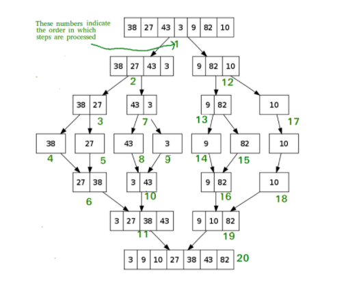

# INTRODUCTION
Understand different sorting algorithms and understand their time and space complexity.
  
 

## BACKGROUND
#### WHAT IS SORTING? 
A Sorting Algorithm is used to rearrange a given array or list elements according to a comparison operator on the elements. The comparison operator is used to decide the new order of element in the respective data structure.

#### WHAT ARE THE DIFFERENT TYPES OF SORTING?
Different types of sorting are based on the extra space used to sort.  
**In-Place sorting** or **Internal Sorting**:
* An in-place sorting algorithm uses constant extra space for producing the output (modifies the given array only). It sorts the list only by modifying the order of the elements within the list. Examples of In-Place sorting algorithms are Insertion sort, Bubble Sort, Quick sort, etc.

**External Sorting** 
* When all data that needs to be sorted cannot be placed in-memory at a time, the sorting is called external sorting. External Sorting is used for massive amount of data.

 

# PRIMARY GOAL:
* Understand the different kind of sorting algorithms
 

# PREREQUISITES:
* A machine with java compiler installed.
* Knowledge of how arraylist data structures work.
* Loads of enthusiasm and a zest for knowledge!

#### NOTE:
>To run the code,use the command:  
  &nbsp;&nbsp;  javac ProgramName.java  
  &nbsp;&nbsp; java ProgramName  
where ProgramName is the name of the program.

# ACTIVITIES:

### ACTIVITY 1:
## SELECTION SORT
How we get ourselves arranged for school assembly in height wise order - pick the smallest one and bringing him to start right? This is selection sort. That we select the smallest term and places it to is correct position.
Selection sort is an algorithm that selects the smallest element from an unsorted list in each iteration and places that element at the beginning of the unsorted list.

The algorithm for this would be :  

#### ALGORITHM-1:
**Selection sort**:
>  1. Set MIN to location 0
>  2. Search the minimum element in the list
>  3. Swap with value at location MIN
>  4. Increment MIN to point to next element
>  5. Repeat until list is sorted

Tip : To read more on selection sort [click here](https://www.geeksforgeeks.org/selection-sort/)

This is implemented in [selectionSort](src/selectionSort.java).  

### ACTIVITY 2:
## BUBBLE SORT
Bubble Sort is the simplest sorting algorithm that works by repeatedly swapping the adjacent elements if they are in wrong order. Bubble sort works similiar to selection sort except selection sort starts sorting by finding the mininum number whereas bubble sort sorts by finding the maximum number.

The algorithm for this would be :  

#### ALGORITHM-2:
**Bubble sort**:
>  1. Iterate over the unsorted array.
>  2. If predecessor of any number is larger swap the terms.
>  3. Repeat the steps 1 and 2 till the complete array is sorted.

This is implemented in [bubbleSort](src/bubbleSort.java). 

Can you guess what the time and space complexity would be?

Think !  
Think !!

Well,you are right !
Time complexity is O(n^2) as we are traversing the array for every element and the space complexity is O(1) as it is In-Place sorting.

**Further Exploration**

Can you implement this Algorithm using recursion?

Tip : Still have doubts about this algorithm? [Read more](https://www.tutorialspoint.com/data_structures_algorithms/bubble_sort_algorithm.htm) 

### ACTIVITY 3:
## INSERTION SORT
Insertion sort uses the trick to arrange card of a deck. We pick a card arrange it in the required position and then move forward by picking another card. The array is virtually split into a sorted and an unsorted part. Values from the unsorted part are picked and placed at the correct position in the sorted part.

#### ALGORTIHM-3
**Insertion Sort**:
> 1. Iterate over the array.
> 2. Compare the current element (key) to its predecessor.
> 3. If the key element is smaller than its predecessor, compare it to the elements before. Move the greater elements one position up to make space for the swapped element.

This algorithm is implemented in [this file](src/insertionSort.java). 

What should be the time complexity of this algorithm?
 

Yes, the worst case / average case complexity of this algorithm is (n^2) when the complete array is reverse.
 
The best Case time complexity would be O(n) when the complete array is sorted. 
  
Does this Algorithm use any extra space? 
No, Hence space complexity is O(1).

Tip : Make sure to check [this link](https://www.geeksforgeeks.org/insertion-sort/) to learn more about this algorithm.

### ACTIVITY 4:
## QUICK SORT
QuickSort is a Divide and Conquer algorithm. It picks an element as pivot and partitions the given array around the picked pivot. There are many different versions of quickSort that pick pivot in different ways. 

1. Always pick first element as pivot.
2. Always pick last element as pivot (implemented below)
3. Pick a random element as pivot.
4. Pick median as pivot. 
The key process in quickSort is partition(). Target of partitions is, given an array and an element x of array as pivot, put x at its correct position in sorted array and put all smaller elements (smaller than x) before x, and put all greater elements (greater than x) after x. All this should be done in linear time.

 

#### ALGORTIHM-4
**Quick Sort**:
> quickSort(arr[], low, high)  
> {  
>    if (low < high)  
>    {  
>        /* pi is partitioning index, arr[pi] is now 
>           at right place */  
>        pi = partition(arr, low, high);  
>
>        quickSort(arr, low, pi - 1);  // Before pi  
>        quickSort(arr, pi + 1, high); // After pi  
>    }  
>}  

Tip : To learn more about divide and conquer approach [click here](https://www.geeksforgeeks.org/divide-and-conquer-algorithm-introduction/). To Know more about quick sort see [this](https://www.geeksforgeeks.org/quick-sort/).

This algorithm is implemented in [this file](src/quickSort.java).

-> Can you try making the recursion tree?

Don't give up too soon!      
Once you done verify your anser with the help of following

**Time Complexity**
1. Worst case: O(n^2)
2. Average case: O(nLogn)
3. Best case: O(nLogn)

**Space Complexity** : O(1)

### ACTIVITY 5:
## MERGE SORT
We have looked into In-Place sorting so far. We will now discuss an external sorting technique.  
Merge Sort is a Divide and Conquer algorithm. It divides the input array into two halves, calls itself for the two halves, and then merges the two sorted halves. The merge() function is used for merging two halves. The merge(arr, l, m, r) is a key process that assumes that arr[l..m] and arr[m+1..r] are sorted and merges the two sorted sub-arrays into one. 

**PREREQUISITES**
* Do you know how to merge 2 sorted arrays?  
Think and give it a try!
 
If you could do it on your own then kudos, otherwise it is implemented in [this file](src/merge.java).

 
 

  
Once you know how to merge two sorted array, implement the following algorithm-

#### ALGORITHM 5:
**Merge Sort**:
> If r > l  
>     1. Find the middle point to divide the array into two halves:   
             middle m = (l+r)/2  
>     2. Call mergeSort for first half:   
             Call mergeSort(arr, l, m)  
>     3. Call mergeSort for second half:  
             Call mergeSort(arr, m+1, r)  
>     4. Merge the two halves sorted in step 2 and 3:  
             Call merge(arr, l, m, r)   

    

Don't get intimidated by this algorithm,its not that hard :)
This algorithm is implemented [here](src/mergeSort.java).

Recursion Tree :

Tip : Don't feel like you are confident about this algorithm? Read [this](https://www.programiz.com/dsa/merge-sort).

Can you find out the Space and Time Complexity?
 
**Time Complexity**: O(nLogn) (as the algorithm divides the array in two equal parts). 

**Space Complexity**: O(N).

**Further exploration** 
1. Which is better Quick sort or merge sort?
2. Which sorting technique should be used to sort linked list? 

### Further exploration:
There are loads of sorting algorithms. Some of them are :
1. Radix Sort
2. Shell sort
3. Heap sort
4. Selection Sort  
and many many more !

## Bravo! 
It's amazing that you could learn all these sorting algorithms. Great work! 
Since with all your dedication and hardwork you have reached till here so test what all you have learned.

### QUESTIONS TO TEST YOUR KNOWLEDGE
>1. Which Algorithm would you use to sort linked list?
>2. Is quick sort a stable Algorithm?
>3. Can you write a recursive code for selection sort?
>4. What Algorithm is preffered to sort a large amount of data?
>5. Which Algorithm is preffered to sort data with minimum time?
>6. If a small amount of data is to be sorted, which algorithm should be used? 

-> Don't Forget to submit your answers in the answers folder. Go ahead and post your soltuions there.(If you aren't familier with the working of PR read [this](https://docs.github.com/en/free-pro-team@latest/github/collaborating-with-issues-and-pull-requests/creating-a-pull-request))

## REFERENCES:  
https://www.geeksforgeeks.org/sorting-terminology/  
https://www.geeksforgeeks.org/time-complexities-of-all-sorting-algorithms/?ref=leftbar-rightbar  

## SUMMARY:
I believe that you are now relatively comfortable with the sorting algorithms and you can implement these. 
For the things we have to learn before we can do them, we learn by doing them.  
Keep Learning :)  
Keep Doing!!

